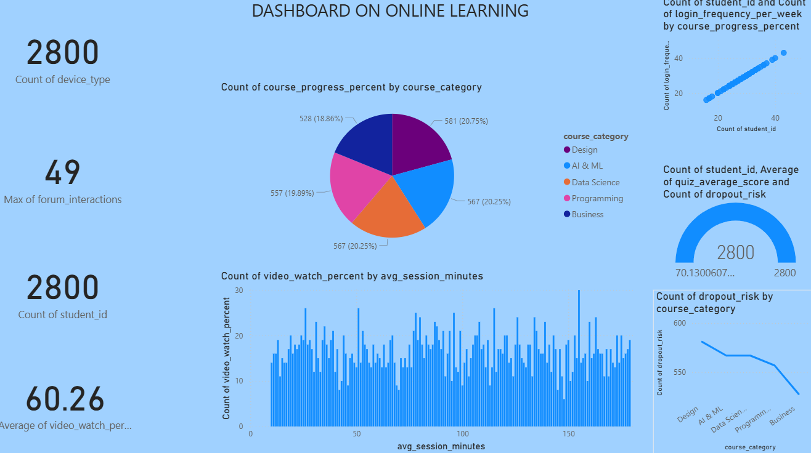

# 📊 Online Learning Analytics Dashboard (Power BI)

---

## 📌 Project Overview
This project presents an *interactive Power BI dashboard* analyzing online learning behavior and student engagement.  
The dashboard provides insights into *student activity, course categories, engagement levels, performance metrics, and dropout risk*.

It helps stakeholders understand:
- Student participation trends  
- Course category distribution  
- Learning engagement patterns  
- Performance and quiz outcomes  
- Dropout risk across categories  

---

## 🖼 Dashboard Preview

---

# 📈 Key Performance Indicators (KPIs)

| KPI | Value | Description |
|----|----|----|
| *Total Students* | *2800* | Total number of learners in the dataset |
| *Device Type Count* | *2800* | Total tracked device usage |
| *Max Forum Interactions* | *47* | Highest engagement in discussion forums |
| *Avg Video Watch %* | *60.26%* | Average content consumption rate |

---

# 📚 Course Category Distribution

This visualization shows how students are distributed across different course categories.

| Course Category | Count | Percentage |
|----------------|------|------------|
| Design | 581 | 20.75% |
| AI & ML | 567 | 20.25% |
| Data Science | 567 | 20.25% |
| Programming | 557 | 19.89% |
| Business | 528 | 18.86% |

### Key Insights

* Course distribution is *well-balanced across categories*  
* *Design courses have the highest participation*  
* Business courses show *slightly lower enrollment*  

---

# 🎥 Video Engagement Analysis

This chart represents video watch percentage based on session duration.

| Session Duration | Engagement Level |
|-----------------|-----------------|
| 0 – 50 mins | Moderate |
| 50 – 120 mins | Stable |
| 120+ mins | Slightly higher |

### Insights

* Engagement remains *consistent across different session lengths*  
* Longer sessions slightly *increase content consumption*  
* Indicates *steady learning behavior* among users  

---

# 📈 Student Activity vs Login Frequency

This scatter plot shows the relationship between number of students and login frequency.

| Observation | Insight |
|------------|--------|
| Positive Correlation | More students → more logins |
| High Activity | Active users log in frequently |

### Insights

* Strong indication of *active platform usage*  
* Frequent logins suggest *high learner engagement*  

---

# 📊 Performance & Dropout Risk Analysis

This section combines:
- Student count  
- Average quiz scores  
- Dropout risk  

| Metric | Value |
|------|------|
| Student Count | 2800 |
| Avg Quiz Score | ~70 |
| Dropout Risk | Medium |

### Insights

* Students show *moderate academic performance*  
* Dropout risk is *present but manageable*  
* Indicates need for *performance improvement strategies*  

---

# ⚠️ Dropout Risk by Course Category

This chart highlights how dropout risk varies across categories.

| Course Category | Dropout Trend |
|----------------|--------------|
| Design | High |
| AI & ML | Slightly lower |
| Data Science | Stable |
| Programming | Moderate |
| Business | Lowest |

### Insights

* *Design courses have the highest dropout risk*  
* Business courses show *better retention rates*  
* Indicates need for *targeted intervention in specific courses*  

---

# 🎛 Dashboard Filters

Users can interact with the dashboard using the following filters:

### Course Category Filter
- Design  
- AI & ML  
- Data Science  
- Programming  
- Business  

---

# 📊 Features of the Dashboard

* Interactive Power BI visuals  
* Course category analysis  
* Engagement tracking (video & sessions)  
* Student activity monitoring  
* Performance & dropout analysis  
* Dynamic filtering for better insights  

---

# 🧠 Business Insights

### 1️⃣ Student Engagement
Students show *consistent engagement*, with stable video watch patterns.

### 2️⃣ Course Popularity
Course distribution is *balanced*, with Design leading slightly.

### 3️⃣ Platform Activity
Login frequency indicates *high user activity and retention*.

### 4️⃣ Performance Analysis
Average quiz scores suggest *moderate academic outcomes*.

### 5️⃣ Dropout Risk
Certain categories (especially Design) need *focused retention strategies*.

---

# 🛠 Tools & Technologies

| Tool | Purpose |
|----|----|
| *Power BI* | Data visualization |
| *Dataset* | Learning analytics data |
| *DAX* | Measures & calculations |
| *GitHub* | Project hosting |

---

# 📂 Project Structure

Online-Learning-Dashboard  
│  
├── Dataset  
│   └── online_learning_data.csv  
│  
├── PowerBI  
│   └── dashboard.pbix  
│  
├── Images  
│   └── dashboard.png  
│  
└── README.md  

---

# 🚀 How to Use

1. Download the *.pbix file*  
2. Open it in *Power BI Desktop*  
3. Use filters to explore course categories  
4. Analyze engagement, performance, and dropout trends  

---

# 📌 Future Improvements

* Add *time-based learning trends*  
* Include *predictive dropout analysis*  
* Add *student segmentation*  
* Integrate *AI-driven insights*  

---

# 👩‍💻 Author

*Vetali Mittal*  
Economics Honours Student | Data Enthusiast | Power BI Learner  

---
